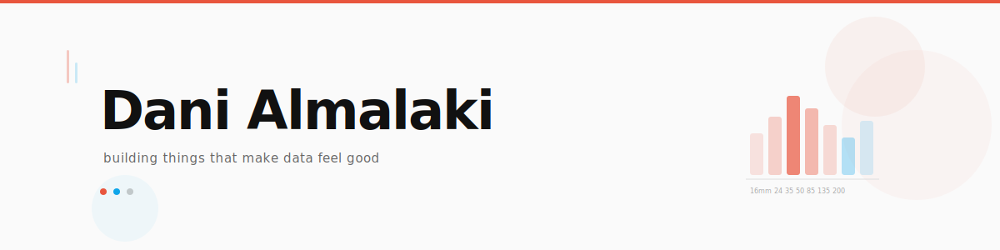
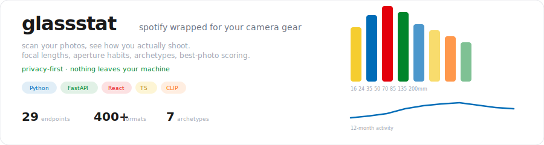
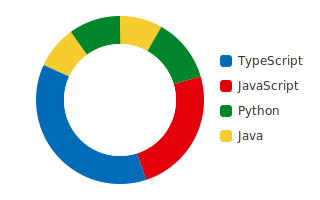
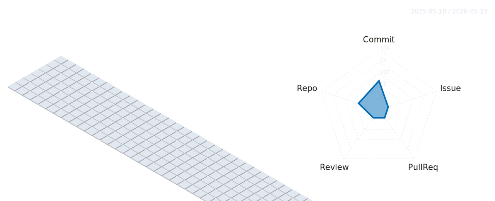

<picture>
  <source media="(prefers-color-scheme: dark)" srcset="assets/header-dark.svg"/>
  <source media="(prefers-color-scheme: light)" srcset="assets/header-light.svg"/>
  
</picture>

<br/>

<p align="center">
  <a href="https://almalaki.dev"></a>&nbsp;
  
</p>

---

### about me

```
🎓  cs @ uw-madison (sophomore)
💼  amazon sde intern — summer 2026
📷  sony a7iv shooter with too many primes
🔨  building glassstat — adding CLIP ML pipeline rn
```

---

<a href="https://github.com/acetodani/glassstat">
  
</a>

---

<p align="center">
  
</p>

---

<p align="center">
  
</p>
