<picture>
  <source media="(prefers-color-scheme: dark)" srcset="assets/header-dark.svg"/>
  <source media="(prefers-color-scheme: light)" srcset="assets/header-light.svg"/>
  
</picture>

<br/>

<p align="center">
  <a href="https://almalaki.dev"></a>&nbsp;
  &nbsp;
  <a href="https://www.linkedin.com/in/daniahalmalaki"></a>
</p>

---

### about me

```
🎓  cs @ uw-madison — rising sophomore
☁️  sde intern @ aws · amazon connect — summer 2026 (now)
🤖  wisconsin humanoids — teaching an AlohaMini to behave
🛠️  swe @ uw design & innovation lab — 3d print queue tooling
📷  photographer · data viz nerd
```

---

### currently

- ☁️ &nbsp;building resilience tooling for **amazon connect** — the fun details are behind the badge
- ✨ &nbsp;building **atlas** — a personal jarvis (electron · react three fiber · claude)
- ✍️ &nbsp;writing at [almalaki.dev](https://almalaki.dev)

---

### projects

| | |
|---|---|
| **[glassstat](https://almalaki.dev)** | spotify wrapped for your camera gear — scan your photo library, see how you *actually* shoot. focal lengths, aperture habits, photographer archetypes. privacy-first, nothing leaves your machine. `python` `fastapi` `react` `CLIP` |
| **[csv-analyzer](https://github.com/acetodani/csv-analyzer)** | drop a csv, get interactive charts — no signup, no server, all in the browser. `javascript` |
| **atlas** | a personal ai assistant with a liquid-glass ui and a wake word. work in progress. `electron` `r3f` `mcp` |

---

### how i build

i pair with ai agents, but with discipline — powered by [mattpocock/skills](https://github.com/mattpocock/skills):

<p align="center">
  <a href="https://github.com/mattpocock/skills"></a>
  <a href="https://github.com/mattpocock/skills"></a>
  <a href="https://github.com/mattpocock/skills"></a>
  <a href="https://github.com/mattpocock/skills"></a>
  <a href="https://github.com/mattpocock/skills"></a>
  <a href="https://github.com/mattpocock/skills"></a>
  <a href="https://github.com/mattpocock/skills"></a>
  <br/>
  <a href="https://github.com/mattpocock/skills"></a>
  <a href="https://github.com/mattpocock/skills"></a>
  <a href="https://github.com/mattpocock/skills"></a>
  <a href="https://github.com/mattpocock/skills"></a>
  <a href="https://github.com/mattpocock/skills"></a>
  <a href="https://github.com/mattpocock/skills"></a>
  <br/>
  <a href="https://github.com/mattpocock/skills"></a>
  <a href="https://github.com/mattpocock/skills"></a>
  <a href="https://github.com/mattpocock/skills"></a>
  <a href="https://github.com/mattpocock/skills"></a>
  <a href="https://github.com/mattpocock/skills"></a>
</p>

---

<p align="center">
  
</p>

<p align="center">
  
</p>
